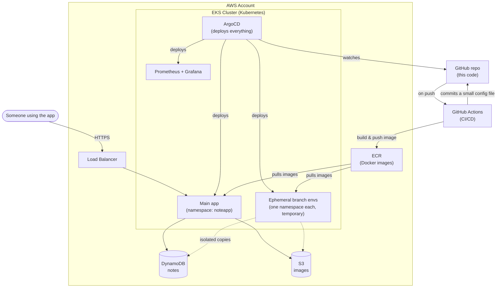
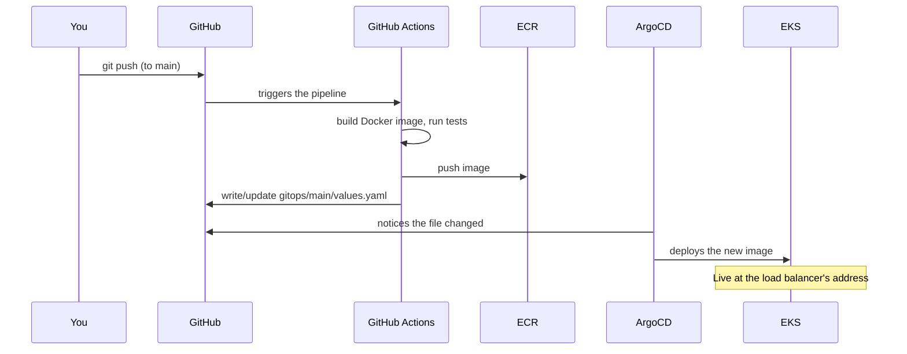
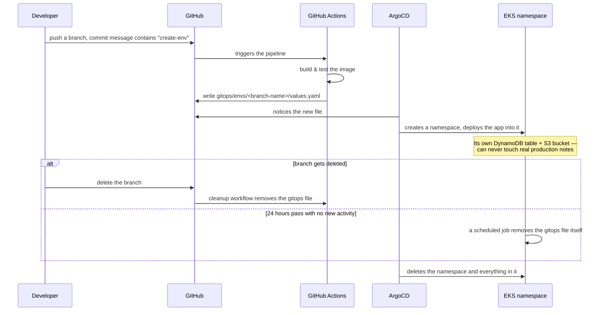

# Notes App

A small Flask notes app (create/read/update/delete notes, image uploads, color tags, drag-to-reorder) — built as a hands-on project for learning how to run a real app on AWS with proper infrastructure-as-code, GitOps, and disposable per-branch test environments.

This document explains the infrastructure in plain terms. For the "why" behind specific decisions, the code itself is commented at the points that matter (IAM policies, Terraform resources, CI workflows).

## The big picture

The app runs on Kubernetes (EKS), stores its data in DynamoDB and S3, and is deployed declaratively: nothing is ever `kubectl apply`'d by hand — everything the cluster runs is described in this Git repo, and a tool called ArgoCD keeps the cluster in sync with it.



**The key idea**: CI (GitHub Actions) never touches the Kubernetes cluster directly. Its whole job is to build a Docker image and write one small YAML file back to this repo saying "here's the image to run." ArgoCD is the only thing that ever actually deploys to the cluster, and it does that by watching this repo — this pattern is called **GitOps**.

## Everyday deployment flow



Nothing here is manual. Terraform changes (infrastructure) follow the same push-triggers-CI pattern, just applying `terraform apply` instead of building an image.

## Ephemeral environments — the "create-env" feature

The whole point of this project: get a **temporary, fully working, isolated copy of the app** for a feature branch, without anyone having to manually set anything up.



A few deliberate design choices worth knowing:
- **Branch names get normalized** into something Kubernetes/Docker can use as a namespace/tag (lowercased, special characters stripped, a short hash appended so two similarly-named branches can never collide).
- **Every push to an active branch refreshes it** — new commit, new image, and the 24-hour clock resets. You don't have to write "create-env" more than once.
- **Ephemeral environments have no public URL** — they're reachable via `kubectl port-forward`, not the load balancer, to avoid the cost and complexity of routing many temporary environments through one shared endpoint.
- **Isolated data**: ephemeral environments read/write a separate DynamoDB table and S3 bucket, never the real ones the main app uses.

## What's actually running, and where it lives in this repo

| What | Where | Purpose |
|---|---|---|
| The app itself | `app/` | The Flask application, HTML templates, CSS |
| Container build | `Dockerfile`, `docker-compose.yml` | How the app gets packaged, and how to run it locally |
| Networking, EKS cluster, IAM | `terraform/eks/` | The cluster, its node group, and every AWS permission anything in the cluster needs |
| Notes/images data store | `terraform/app/` | The DynamoDB table and S3 bucket (production and the isolated non-prod copies) |
| One-time bootstrap | `terraform/bootstrap/` | The S3 bucket Terraform itself uses to store its state, and the CI roles — applied by hand once, since nothing else can exist yet to apply it automatically |
| What runs in the cluster | `helm/` | The app's own Helm chart, monitoring stack config, and the 24h cleanup job |
| GitOps definitions | `argocd/` | What ArgoCD watches and how it's allowed to deploy things |
| Live deployment state | `gitops/` | CI writes here; ArgoCD reads from here. `main/` is the permanent app, `envs/` is ephemeral branches |
| CI/CD pipelines | `.github/workflows/` | Build, test, deploy, terraform, cleanup — all automated |
| Shared scripts | `scripts/` | Branch-name normalization, version bumping, safe git pushes |

## Running it locally

```
docker compose up -d --build
```

This builds the app and runs it against the **real** AWS DynamoDB table/S3 bucket by default (using your local AWS CLI credentials, mounted read-only into the container — no keys are baked into the image). Visit `http://localhost:8081`.

## Cost

The EKS control plane alone is a flat ~$73/month, regardless of how much or little the app is used — that's the single biggest, unavoidable line item. All-in, the always-on baseline (cluster, node group, load balancer, monitoring) runs roughly **$125-133/month**. An active ephemeral environment costs close to nothing extra on top, since it shares the already-running nodes rather than spinning up new infrastructure.
